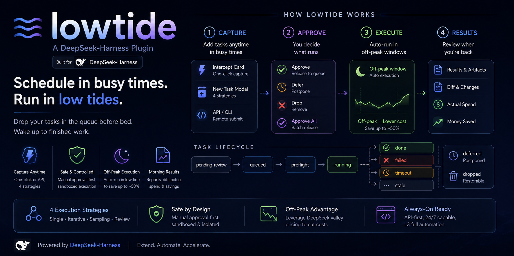
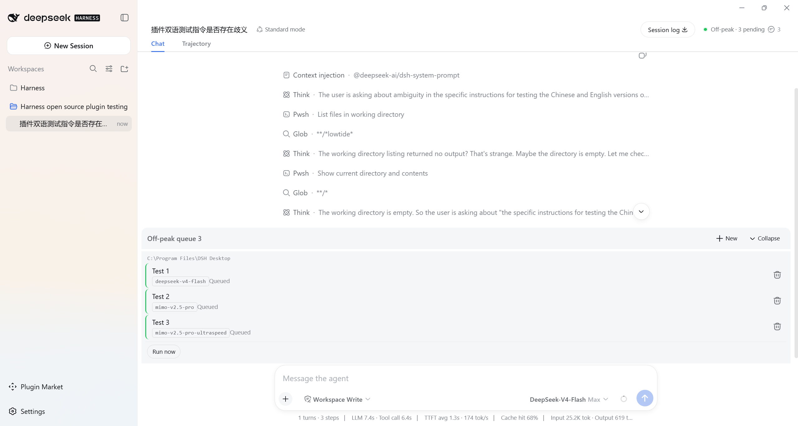
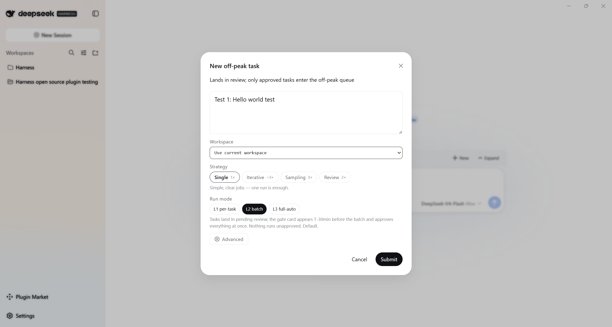
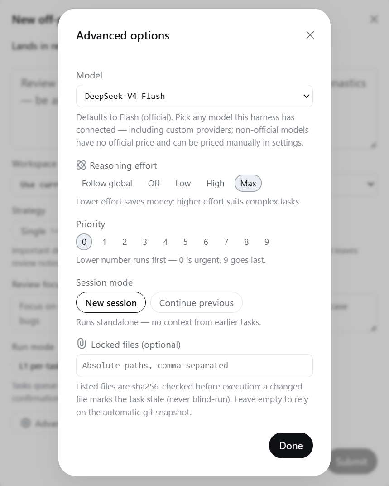
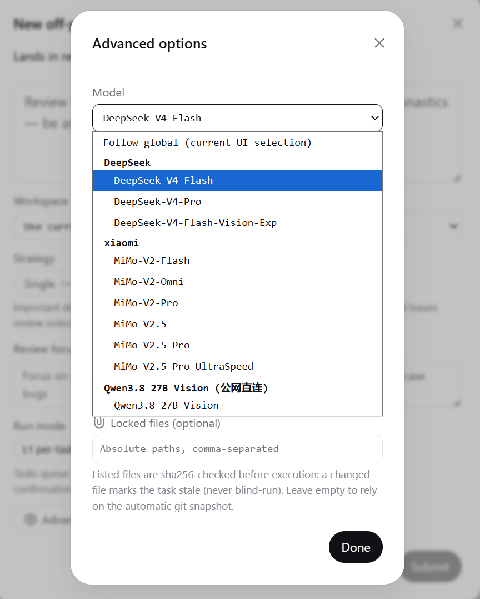
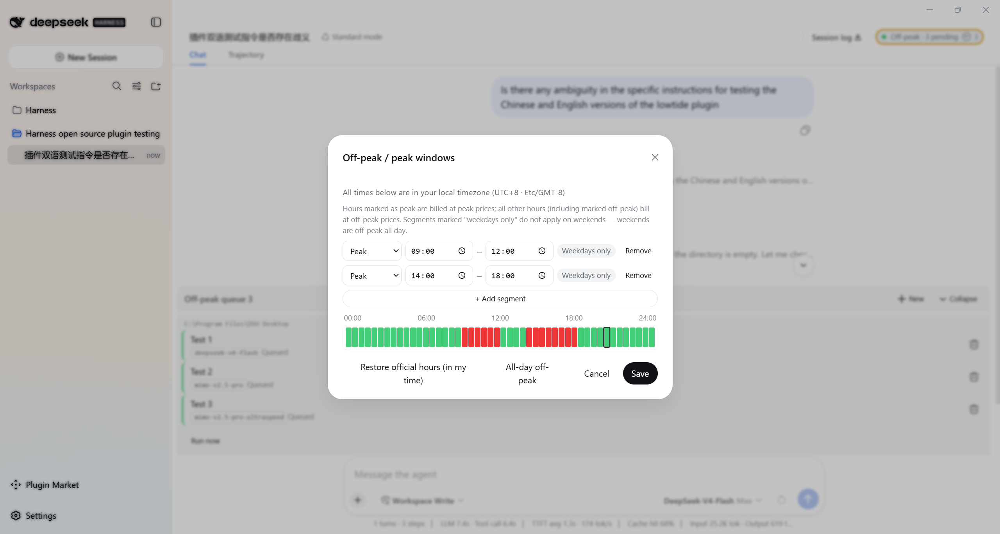
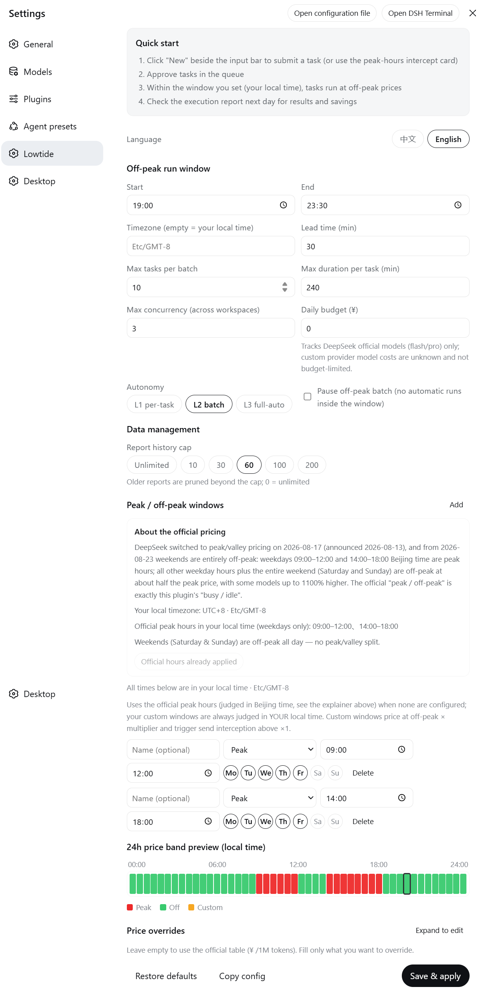

<div align="center">

# dsh-lowtide

**Le attività entrano in coda nelle ore di punta e girano da sole in quelle libere.**

<sub>Modalità semiautomatica o automatica, evitando le ore e i prezzi di punta dei modelli. Un plugin indispensabile per DeepSeek Harness.</sub>

**Italiano** | [English](../README.md) | [简体中文](../README.zh-CN.md) | [繁體中文](../README.zh-HK.md) | [العربية](./README.ar.md) | [Deutsch](./README.de.md) | [Español](./README.es.md) | [Français](./README.fr.md) | [한국어](./README.ko.md)



</div>

> **Nota sulla lingua dell'interfaccia:** nella versione attuale, l'interfaccia (UI) del plugin lowtide è disponibile solo in **cinese semplificato** e **inglese**; il selettore di lingua all'interno dell'applicazione non include altre lingue. Questo README è una traduzione in italiano del documento originale in inglese, realizzata solo per comodità di lettura. Il funzionamento del plugin non dipende dalla lingua di questo documento.

---



<p align="center"><i>Tre attività in attesa nella coda, l'indicatore del prezzo che brilla nell'intestazione della sessione, esecuzione automatica all'apertura della finestra</i></p>

## Introduzione

lowtide è un plugin per [DeepSeek Harness (dsh)](https://github.com/deepseek-ai/dsh). Il problema che risolve è semplice e del tutto naturale:

Di solito, quando vuoi che un agente faccia del lavoro, resti al computer, invii un'istruzione all'agente, aspetti la risposta e poi la controlli a mano. Ma questo flusso di lavoro sembra dimenticare che hai un sacco di tempo libero — e l'occasione di evitare i prezzi di punta/valle applicati da alcuni modelli.

Con lowtide installato, la giornata funziona così: ogni volta che durante il giorno ti viene in mente un lavoro, gettalo in coda, dagli un'occhiata, rilascialo. Le attività si accumulano fino all'orario che hai impostato (per esempio dopo le 19:00 — è allora che DeepSeek applica i prezzi di valle), poi girano da sole. La mattina dopo apri il rapporto: tieni ciò che è andato bene, rimanda indietro ciò che non è andato.

Tutto qui. Ma usalo per una settimana e il tuo ritmo di lavoro rallenta davvero — e non dimenticare: "il tempo è denaro, l'efficienza è vita"……

Alcune capacità concrete:

- Quattro strategie di esecuzione: singola, iterativa, campionamento, revisione — da "un solo passaggio basta" a "esegui cinque candidati e sceglierò io"
- 168 test unitari + 10 specifiche e2e, CI verde su ubuntu / windows × node 22 / 24
- Un unico artefatto di build serve sia desktop che web — installa una volta, funziona ovunque
- L'esecuzione fuori punta atterra nelle ore di valle di DeepSeek: lo stesso lotto costa circa la metà della punta

## Una giornata normale con un agente potrebbe essere così…

**Dieci minuti prima di uscire dall'ufficio.** Hai finito di rivedere il codice, quindi crei tre ticket per domani: un refactoring (iterativa, 3 round), un rapporto settimanale (singola) e un design di cui non sei sicuro (campionamento, 4 candidati). Rilasciali tutti, spegni, esci. Domani alla scrivania, il rapporto del mattino dice: il refactoring è fatto, il rapporto è abbozzato e quattro design candidati stanno uno accanto all'altro, ognuno con il suo costo scritto.

**Venerdì sera.** Metti in coda una settimana di faccende in una volta sola: pulizia delle dipendenze, test mancanti, script per i dati. Nel fine settimana il prezzo di valle vale 24 ore su 24. Tu esci; lui lavora da casa. Lunedì controlli il rapporto — riprova ciò che è fallito, integra ciò che è buono.

**Un'intuizione alle 10 del mattino.** Sei a metà di una conversazione con l'agente su un bug urgente quando pensi "ehi, aggiorna anche i documenti". La scheda di intercettazione appare: eseguirlo ora costa il prezzo di punta, stasera circa la metà — la differenza è spiegata. Clicca su "metti in coda per la valle"; la tua bozza sopravvive intatta e torni al bug.

**Un server sempre acceso.** Hai una macchina che esegue dsh 24/7. Passa alla modalità L3 completamente automatica, poi inserisci attività da qualsiasi luogo tramite l'API (`POST /ds-lowtide/tasks`). Le esegue secondo programma e scrive il rapporto. Nessuno guarda, ma la sandbox, il budget giornaliero e i blocchi dei file sono ancora lì.

**Qualcosa che va a un cliente.** Usa la strategia di revisione: esegui una volta, poi apri automaticamente una sessione indipendente che smonta il risultato secondo il focus scelto (per esempio "cerca errori nelle fonti dei dati"). Al mattino non ottieni un risultato nudo — ottieni un risultato più una revisione critica.

**Vivere all'estero.** Sei a San Francisco; il picco di DeepSeek è in ora di Pechino, che per te significa la sera e la notte del giorno prima. Le impostazioni convertono le ore ufficiali nel tuo orologio locale, adozione con un clic. Imposti le finestre secondo i tuoi ritmi e i conti restano sempre allineati alla tabella ufficiale.

## Come funziona lowtide

```
① Inserimento          ② Arbitrato           ③ Esecuzione           ④ Accettazione
Ogni volta che hai un   Il dock della coda    Quando si apre la       Quando torni:
momento: un clic        raggruppa le attività finestra di valle:      apri il rapporto —
dalla scheda di         per area di lavoro;   cinque cancelli di →    risultati + diff
intercettazione, o →    arbitra riga per →    preflight passano,      + spesa reale
apri un ticket          riga:                 poi esecuzioni in       + denaro risparmiato
(4 strategie)           ✓approva ⏸rinvia      sandbox, un lotto
                        ✕scarta / approva-tutto per finestra
```

La vita di un'attività: `pending-review → queued → preflight → running → done / failed / stale / timeout`, più `deferred` (rinviata) e `dropped` (eliminazione logica, ripristinabile).

Il secondo passaggio è ciò che distingue lowtide da uno "script completamente automatizzato": **ogni attività deve essere rilasciata dalla tua mano prima di essere eseguita** (in L2 rilasci l'intero lotto in una volta, 30 minuti prima della finestra). La macchina non può infilarsi da sola nella coda di esecuzione. L'esecuzione è automatizzata; le decisioni no. Ecco perché puoi permetterti di essere assente.

## Un giro dell'interfaccia di lowtide

**Il modale di nuova attività.** Quattro strategie affiancate, ciascuna con un suggerimento in linguaggio semplice; round, priorità e modalità di esecuzione viaggiano con ogni attività — nessun viaggio di ritorno alle impostazioni. Le attività arrivano come "pending review". Niente ti aggira per entrare in coda.



**Opzioni avanzate.** Modello, sforzo di ragionamento, priorità da 0 a 9, nuova sessione o continua la precedente, e l'elenco dei file bloccati — tutto in un piccolo pannello. File bloccati, in breve: qualsiasi cosa nell'elenco viene verificata con sha256 prima dell'esecuzione e, se non corrisponde a ciò che hai inserito, l'attività diventa obsoleta (`stale`) e rifiuta di essere eseguita. Altrimenti il file contro cui hai messo in coda potrebbe essere riscritto da un'altra attività mentre aspetti, e questa lo calpesterebbe alla cieca.



**Scegli qualsiasi modello.** L'esecuzione batch usa di default l'ufficiale `deepseek-v4-flash`, ma ogni attività può scegliere il proprio modello — qualsiasi cosa collegata al tuo Harness appare nel menu a tendina, raggruppata per provider. Anche i provider privati funzionano. I modelli non ufficiali non hanno una tabella prezzi pubblica, quindi il libro mastro dice onestamente "prezzo sconosciuto"; aggiungi un override del prezzo nelle impostazioni se vuoi una contabilità esatta.



**L'editor delle finestre.** Multi-segmento, notturne, per giorno della settimana — tutto possibile. Sotto c'è una banda prezzi live su 24 ore: rosso per la punta, verde per la valle, e un indicatore che mostra dove ti trovi adesso. Fuori da UTC+8, un clic su "adotta le ore di punta ufficiali" converte l'ora di Pechino nel tuo orologio locale.



**La pagina delle impostazioni.** Ore delle finestre, attività per lotto, tetto di durata per attività, concorrenza, budget giornaliero, cronologia dei rapporti, livello di autonomia, override dei prezzi — tutto grafico, nessun file di configurazione. Le regole tariffarie ufficiali (inclusa la nuova valle per tutto il fine settimana) sono spiegate in linguaggio umano sulla stessa pagina.



Altre tre superfici si nascondono nel flusso quotidiano: la **pillola del prezzo** (intestazione della sessione — occupato/inattivo, conto alla rovescia, dimensione della coda; clic per modificare le finestre), la **scheda di intercettazione in punta** (scrivi in punta, appare; la differenza di prezzo è spiegata; la tua bozza sopravvive) e il **rapporto di esecuzione** (il briefing del mattino: risparmi per primi, anomalie evidenziate, candidati in attesa della tua scelta, copia Markdown con un clic).

## Le aree di lavoro di lowtide

Ogni attività viene eseguita all'interno di un'area di lavoro. Quell'unico menu a tendina decide tre cose.

**Quali file può toccare.** Le attività girano in una sandbox il cui confine è la directory dell'area di lavoro. Scelta sbagliata: nel migliore dei casi non trova i file; nel peggiore modifica ciò che non dovrebbe.

**Con chi fa la coda.** Le attività nella stessa area di lavoro girano in serie (due attività non litigano mai per un repository); aree di lavoro diverse girano in parallelo (limite predefinito 3, regolabile). Vuoi produttività? Distribuisci il lavoro non correlato su più aree. Vuoi ordine? Tienilo tutto in una.

**Come si raggruppano i rapporti.** Sia il dock che il rapporto del mattino si organizzano per area di lavoro — una volta che hai volume reale, questo raggruppamento ripaga.

Il menu Area di lavoro nel modale dei ticket ha tre fonti: **Usa l'area di lavoro corrente** (quella in cui vive la tua sessione — il caso comune), **un'area di lavoro esistente dall'elenco** (ciascuna con il suo percorso assoluto, così sai sempre di quale progetto si tratta), o **Percorso personalizzato…** (scrivilo a mano). Se hai scelto "Continua la precedente" come modalità di sessione, sceglierai anche l'area di lavoro e la conversazione esatta — l'attività riprende con il contesto di quella conversazione.

Il mio consiglio: **un progetto, un'area di lavoro — non mescolare.** Lo snapshot git e i blocchi dei file nel preflight sono limitati all'area di lavoro; mescolare progetti in un'unica area è un buon modo per confondersi.

## Quattro strategie e quando usare quale

| Strategia | Cosa fa | Quando ricorrervi | Costo |
|---|---|---|---|
| **Singola** | Un passaggio, fatto | Compiti semplici e ben definiti | 1× |
| **Iterativa** | 2–5 round in una sessione, ciascuno migliora il precedente attraverso la tua "lente di iterazione"; termina presto quando due round si assomigliano abbastanza | Lavoro che richiede rifinitura: scrittura, piani, codice | ~N× |
| **Campionamento** | 2–5 sessioni isolate producono ciascuna un candidato completo, mostrati affiancati con i costi — **tu** scegli; la macchina non fa giudizi estetici | Titoli, idee, design: vuoi opzioni, non una risposta | ~N× |
| **Revisione** | Dopo l'esecuzione, una sessione indipendente smonta il risultato secondo il tuo "focus di revisione" e scrive le sue conclusioni | Consegne importanti, un ultimo passaggio prima dell'invio | ~2× |

## Tre livelli di autonomia

- **L1 per attività**: ogni attività ha bisogno del tuo ✓ individuale. Usalo all'inizio, o quando il repository è prezioso.
- **L2 per lotto** (predefinito): le attività aspettano in revisione; una scheda cancello appare 30 minuti prima del lotto e rilascia tutto in una volta; nessun rilascio, nessuna esecuzione. Lo strumento di tutti i giorni.
- **L3 completamente automatico**: le attività inserite si mettono subito in coda e girano nella sandbox in valle, zero conferme (il passaggio chiede due volte). Costruito per server sempre accesi.

Le singole attività possono sovrascrivere il livello globale nel modale dei ticket.

## Architettura: come funziona mentre non ci sei

Lasciare che un agente esegua lotti mentre dormi è chiedere molto. Quattro strati sotto lo rendono sicuro.

**Il microkernel Cordis.** dsh gira sull'ecosistema di plugin del microkernel Cordis: ogni capacità è un plugin e i plugin comunicano tramite iniezione di servizi piuttosto che dipendenza diretta. La metà host di lowtide è un insieme di servizi Cordis ben educati — route, scheduler, macchina a stati — ognuno fa il suo lavoro, registrato nel kernel, che parte con l'harness e si disinstalla pulitamente. In parole povere: non è una pelle incollata su dsh; è un organo coltivato dentro il kernel.

**Due facce, un artefatto.** La metà host (Node.js) possiede pianificazione, esecuzione e libro mastro; la metà browser (React) possiede ogni pixel. Una build produce entrambe — e poiché la GUI di dsh Desktop è essa stessa resa in web, desktop e web non hanno bisogno di rami separati. Stessi byte, stesso comportamento.

**Un core indipendente dalla piattaforma.** `lowtide-core` contiene il modello delle finestre, le tabelle dei prezzi, la formula di fatturazione, il riepilogo della coda, il libro mastro e la matematica delle finestre di lotto — tutte funzioni pure che non toccano nessuna API dsh, pubblicate come pacchetto autonomo con i propri test. Il vantaggio pratico: il core è stato martellato da 44 test unitari di funzioni pure e, se un giorno porti lowtide su un altro framework di agenti, questo pacchetto si estrae intatto.

**Difesa in profondità.** Cinque cancelli di preflight (l'area di lavoro c'è ancora, il HEAD git si è mosso, gli sha256 dei file bloccati corrispondono, il task entra nella finestra, resta budget) — se uno fallisce, l'attività diventa obsoleta o viene rinviata; mai un'esecuzione alla cieca. Tre preset di sandbox con approvazione su "never" — non presidiato significa che non c'è nessuno a cliccare "consenti", quindi ciò che è permesso si decide prima dell'inizio dell'esecuzione. Il file di stato viene scritto atomicamente e torna a un backup se corrotto. Le route HTTP accettano solo richieste same-origin da questa macchina.

La sincronizzazione di stato usa SSE con un polling di ripiego di 4 secondi — la coda si muove, l'interfaccia si muove con essa.

## Installazione

**Installazione con un comando (precompilato):** `dsh plugin --profile web add https://github.com/KelaoHu/dsh-lowtide/releases/latest/download/dsh-lowtide.tgz` — oppure compila dai sorgenti qui sotto.

Prerequisiti: Node `^22.19 || >=24`, pnpm `11.7`. Tutto è sul registro pubblico npm — nessun registro privato necessario.

Installa prima dsh (scegli uno): Desktop dai canali ufficiali di DeepSeek, oppure `npm install -g @deepseek-ai/dsh` per la CLI. Poi configura un modello funzionante nelle impostazioni di dsh (per esempio una chiave API ufficiale di DeepSeek) — lowtide non tocca mai le tue credenziali.

Poi clona, compila, installa:

```powershell
git clone https://github.com/KelaoHu/dsh-lowtide
cd dsh-lowtide
pnpm install

# Compila prima il livello del core (i test del plugin risolvono il suo output)
pnpm --filter lowtide-core bundle
# Poi il plugin: metà host + metà browser in un solo passaggio
pnpm --filter dsh-lowtide bundle

# Installa in un profilo — un artefatto serve desktop e web
npx @deepseek-ai/dsh@0.1.0-rc.7 plugin --profile desktop add ./packages/dsh   # Desktop
npx @deepseek-ai/dsh@0.1.0-rc.7 plugin --profile web add ./packages/dsh       # Web

# Avvia l'istanza di sviluppo (porta 3080)
pnpm --filter dsh-lowtide dev
```

Dopo apri dsh: dovresti vedere la pillola del prezzo nell'intestazione della sessione e il dock della coda accanto all'area di input. In caso contrario, controlla le FAQ qui sotto.

## Uso quotidiano

**Tre modi per inserire un'attività.** La scheda di intercettazione (scrivi in punta, un clic, la tua bozza diventa il ticket invariato); il modale dei ticket ("Nuovo" accanto all'area di input — prompt, strategia, round, priorità); o l'API (`POST /ds-lowtide/tasks`, collegala alla tua automazione).

**La vita nel dock della coda.** Raggruppata per area di lavoro in attesa / completate / scartate. In linea per attività: ✓ approva, ⏸ rinvia, ✕ scarta (eliminazione logica, ripristinabile). "Approva tutto" rilascia tutto; "pulisci completate" tiene tutto in ordine (i conti non sono toccati); "Esegui ora" salta l'attesa e lancia subito un lotto — è così che fai debug.

**Semantica del tempo.** Le ore di punta ufficiali sono giudicate in **ora di Pechino** (DeepSeek fattura in ora di Pechino, quindi i conti restano allineati; il fine settimana è valle tutto il giorno). Le tue finestre personalizzate e la finestra di esecuzione sono giudicate in **ora locale**, con intervalli notturni e regole per giorno della settimana. La fine della finestra ferma i nuovi avvii; le attività in corso non vengono mai interrotte.

**Il libro mastro.** `ledger[YYYY-MM-DD] = { yuan, savedYuan }` — spesa e risparmio, accumulati ogni giorno. Il prezzo mostrato è il prezzo fatturato: una formula, verificabile fino all'ultima cifra.

## Riferimento configurazione

`GET /ds-lowtide/config` legge; `PUT` aggiorna parzialmente (i campi non elencati vengono rifiutati):

| Campo | Tipo | Predefinito | Note |
|---|---|---|---|
| `autonomy` | `'l1'\|'l2'\|'l3'` | `l2` | Livello di autonomia; override per attività nel modale dei ticket |
| `batch.window` | `"HH:MM-HH:MM"` | `19:00-23:30` | Finestra di esecuzione in valle (fuso locale) |
| `batch.tz` | fuso IANA | sistema | Fuso della finestra di esecuzione (vuoto = locale) |
| `batch.gateLeadMin` | minuti | `30` | Anticipo del cancello del lotto |
| `batch.maxTasksPerNight` | numero | `10` | Limite attività per lotto |
| `batch.maxDurationMin` | minuti | `240` | Limite di durata per attività (annulla + un nuovo tentativo al timeout) |
| `batch.maxConcurrency` | numero | `3` | Concorrenza massima 1–8 (seriale per area, parallelo tra aree) |
| `batch.paused` | booleano | `false` | Metti in pausa l'elaborazione batch automatica |
| `budgetDailyYuan` | ¥ | `0` | Budget giornaliero (0 = illimitato) |
| `windows[]` | array | `[]` | Finestre personalizzate; vuoto = punta ufficiale (ora di Pechino) |
| `windows[].level` | `peak\|off\|custom` | — | Punta / valle / personalizzata (prezzo valle × moltiplicatore) |
| `windows[].start/end` | `"HH:MM"` | — | Orologio locale, supporta la notte |
| `windows[].days` | array `1..7` | ogni giorno | Giorni ISO (1 = lun … 7 = dom) |
| `windows[].tz` | fuso IANA | sistema | Fuso per finestra |
| `windows[].multiplier` | numero | `1` | Moltiplicatore del prezzo valle per finestre personalizzate |
| `prices[model].{peak,off}.{input,inputCached,output}` | ¥/1M | ufficiale | Override della tabella prezzi |

## API HTTP

Prefisso `/ds-lowtide/`, dietro il recinto di fiducia same-origin + loopback:

| Metodo | Percorso | Scopo |
|---|---|---|
| GET | `/state` | Stato aggregato (prezzi/conto alla rovescia/coda/ultimo rapporto) |
| GET | `/events` | Push incrementale SSE (il client ripiega su polling di 4s) |
| GET/PUT | `/config` | Leggere/scrivere configurazione |
| POST | `/tasks` | Inserire un ticket |
| POST | `/tasks/:id/approve \| defer \| drop \| cancel \| retry \| restore \| delete \| choose-candidate` | Arbitrato e gestione |
| POST | `/tasks/approve-all` | Approva tutto |
| POST | `/estimate` | Stima: punta vs valle |
| POST | `/batch/run-now` | Esegui il lotto ora |
| POST | `/dismiss` | Nessuna intercettazione per il resto della giornata |
| GET | `/health` | Battito cardiaco |

## Preset di autorizzazione

| preset | sandbox | approvazione |
|---|---|---|
| `lt-readonly` | read-only | never |
| `lt-standard` | workspace-write | never |
| `lt-trusted` | danger-full-access | never |

L'interfaccia di inserimento non offre scelta — tutte le attività girano sotto `lt-standard`; gli altri due restano per i chiamanti API (`permissionPreset` su `POST /tasks`). Niente gira senza preflight.

## Dati e stato

- Tutto persiste in `$DSH_HOME/lowtide.json` (scritture atomiche, rollback automatico in caso di corruzione); con `DSH_PROFILE` impostato, lo stato è isolato per profilo. **Un solo scrittore per file alla volta** — non eseguire Desktop e Web insieme senza isolamento del profilo.
- Un lotto per finestra, sicuro oltre la mezzanotte; una coda vuota non produce un rapporto vuoto.
- Recupero dei rinvii: all'apertura della finestra, le attività rinviate dal preflight si rimettono in coda automaticamente (fallite dopo ≥3); quelle rinviate manualmente tornano a pending-review.

## Test e CI

```powershell
pnpm --filter lowtide-core test    # 44 test core di funzioni pure
pnpm --filter dsh-lowtide test     # 124 test unitari del plugin
pnpm --filter dsh-lowtide exec playwright test   # e2e (richiede dsh web su :3080)
```

Dieci specifiche e2e girano in serie, dallo smoke di caricamento a due facce fino al ciclo completo inserimento→arbitrato→esecuzione→rapporto contro la vera API. Il repository include un workflow GitHub Actions: ogni push / PR esegue install → build → typecheck → l'intera suite unitaria su quattro ambienti.

## Sicurezza

- Le route accettano solo loopback + same-origin; **non esporre la porta 3080 a internet pubblico** — usa un tunnel SSH o un proxy inverso autenticato.
- La sandbox di Windows è di livello mitigazione; Linux/macOS applicano la protezione in pieno. Per l'uso non presidiato, impila la whitelist dei file e il budget giornaliero.
- Il passaggio a L3 completamente automatico chiede due volte.
- Il file di stato contiene prompt completi e percorsi; tratta i backup di conseguenza.
- Segnala le vulnerabilità in privato tramite [SECURITY.md](../SECURITY.md).

## FAQ

**La finestra è arrivata e non è girato nulla?**
Controlla in ordine: attività approvate? → "pausa batch in valle" spuntato? → cancello rilasciato? → budget esaurito? → preflight fallito (l'attività diventa `stale`, motivo nella vista dettagli)?

**Perché il campionamento non sceglie automaticamente il vincitore?**
Di proposito. La macchina non fa giudizi estetici — candidati e costi stanno affiancati, e tu clicchi su "scegli questo".

**Sono all'estero e le ore di punta non coincidono con i miei orari?**
Le impostazioni mostrano come appaiono le ore ufficiali in locale; imposta finestre personalizzate per il tuo ritmo, oppure clicca su "adotta le ore di punta ufficiali (convertite nel mio fuso)".

**Stima e spesa reale non coincidono?**
Le stime usano un limite superiore approssimativo dei token di input; la spesa reale usa l'uso reale (output e hit di cache inclusi). Entrambi i numeri sono nel rapporto.

**Un'attività è diventata obsoleta (`stale`)?**
Preflight fallito: area di lavoro sparita, snapshot git spostato, un file bloccato cambiato, budget insufficiente o finestra che non ci sta. Leggi `lastError` nei dettagli, correggi, `retry`.

## Limiti noti e roadmap

- Candidato alla release (v0.1.1), installato dal sorgente; e2e richiede un'istanza dsh web viva.
- Il modello batch predefinito è `deepseek-v4-flash`; i modelli non ufficiali non hanno tabella prezzi pubblica — il libro mastro li segna come "prezzo sconosciuto", compilabile nelle impostazioni.
- Limite per attività di 240 minuti; il timeout annulla e riprova una volta.
- Candidati della roadmap: più finestre e lotti, grafi di dipendenza tra attività, ripartizione automatica del budget, invio dei rapporti (email/Webhook), avvisi di variazione prezzi.

## Struttura del repository

```
dsh-lowtide/
├── README.md                  English
├── README.zh-CN.md            Versione in cinese semplificato
├── README.zh-HK.md            Versione in cinese tradizionale
├── assets/screenshots/        Screenshot del README
├── docs/                      README multilingue (ar, de, es, fr, it, ko)
├── LICENSE                    MIT
├── CHANGELOG.md               Cronologia delle versioni
├── CONTRIBUTING.md            Guida alla contribuzione
├── CODE_OF_CONDUCT.md         Codice di condotta
├── SECURITY.md                Politica di sicurezza
├── .github/                   Workflow CI + template issue/PR
├── package.json               Radice del workspace pnpm
└── packages/
    ├── core/                  Core indipendente dalla piattaforma (lowtide-core)
    │   ├── src/               windows / pricing / model / digest / ledger / scheduler
    │   └── test/              Test unitari di funzioni pure
    └── dsh/                   Il plugin (dsh-lowtide)
        ├── src/               Metà host: routes / runner / scheduler / intake / store / state-machine
        ├── client/            Metà browser: components / hooks / i18n / store
        ├── test/              Test unitari + e2e (Playwright)
        ├── cordis.patch.yml   Riga del plugin + preset di autorizzazione lt-*
        └── README.md          README a livello di pacchetto
```

## Qualche parola onesta

Che questo plugin di Harness sia del popolo, dal popolo e per il popolo. Che la saggezza della comunità open source e la volontà di collaborare non periscano mai dalla faccia della terra.

## Licenza e ringraziamenti

Licenza MIT (vedi [LICENSE](../LICENSE)).

- Costruito su [DeepSeek Harness (dsh)](https://github.com/deepseek-ai/dsh) · l'ecosistema di plugin Cordis
- [Annuncio prezzi di DeepSeek (2026-08-13)](https://finance.eastmoney.com/a/202608133840616378.html) · [copertura della data di efficacia (2026-08-17)](https://www.dzwww.com/news/ssnews/202608/t20260817_18025522.htm) · [avviso prezzi del fine settimana](https://www.ithome.com/0/993/095.htm)

---

> **Promemoria finale:** l'interfaccia del plugin lowtide supporta in questa versione solo il **cinese semplificato** e l'**inglese**. Questo README in italiano è una traduzione di cortesia; in caso di discrepanze, fa fede il documento originale in inglese (`README.md`).
